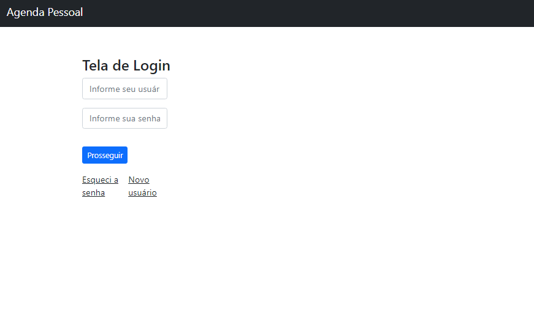
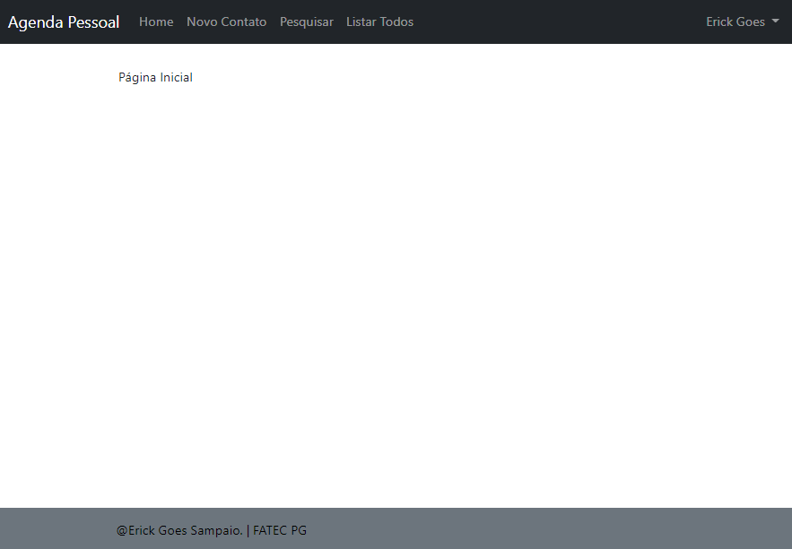
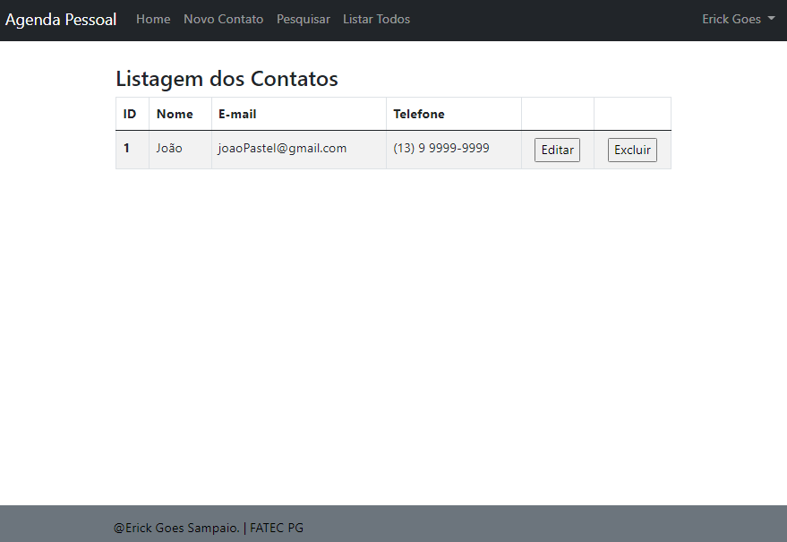
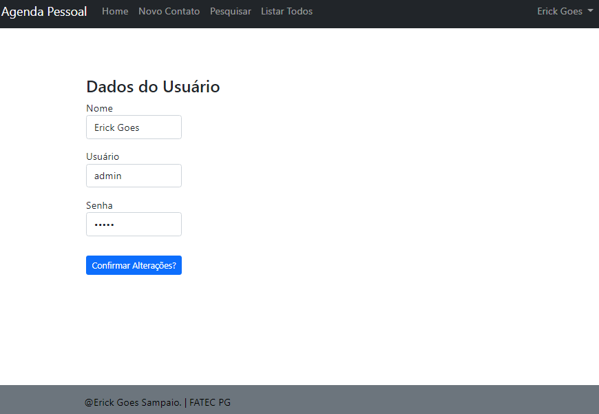

# AGENDA PHP
Este projeto tem como intuito simular uma agenda virtual com cadastro de nome, email e telefone.
Tambem futura mente será implantado uma função que o usuarios pederá escolher algumas opções, como calculo de imc de uma pessoa e até uma calculadora virtual. 

### Scripts SQL

```sql
CREATE DATABASE agenda;

CREATE TABLE usuarios
(
    id       INT(3)         NOT NULL PRIMARY KEY AUTO_INCREMENT,
    nome     VARCHAR(50)    NOT NULL,
    usuario  VARCHAR(32)    NOT NULL,
    senha    VARCHAR(32)    NOT NULL
);

CREATE TABLE contatos
(
    id           INT(3)         NOT NULL PRIMARY KEY AUTO_INCREMENT,
    usuario_id   INT(3)         NOT NULL,
    nome         VARCHAR(50)    NOT NULL,
    email        VARCHAR(50)    NOT NULL,
    telefone     VARCHAR(20)    NOT NULL
);
```
## Pasta views

Os arquivos dá pasta views são html com poucas configuraçoes em php com metodos para interações e configurações de backend para os arquivos das demais pastas do projeto

## Pasta src

 >Contato
  Há todas as configuraçoes de contatos utilizando CRUD utilizando foreach
 >Database
  Configuraçoes de conexão para o Banco de dados do sistema
 >Usuario
 Há todas as configuraçoes de usuario utilizando CRUD

## controller

  faz o controle de acesso e funcionalidades do sistema utilizando Switch

## Composer

As alterações em classes deverão ser atualizadas utilizando o comando <code>composer dump-autoload -o</code>

## Imagens do projéto
<code></code>
<code></code>
<code></code>
<code></code>
<code></code>
<code></code>
